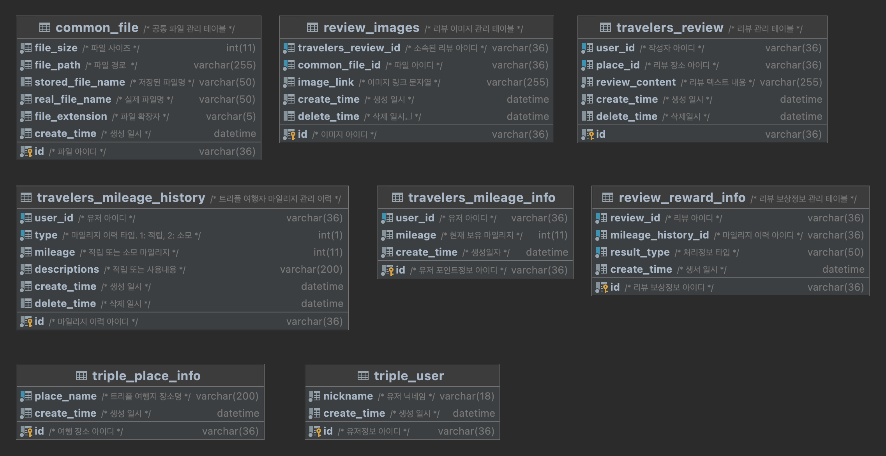

## 트리플 여행자 클럽 마일리지 서비스

### 1. 설명

* 다음의 내용을 참고 부탁드립니다.
> 먼저 환경구성은 이미 도커 컨테이너 환경으로 서비스-DB가 구성되어있습니다.
> 따라서, 테스트시 docker-compose가 필요합니다. 또한 원활한 테스트진행을 위해 기본 데이터를 넣어두었습니다.

* 진행순서
  1. 소스코드 다운로드 해당 프로젝트를 `zip`파일로 다운 받아 압축을 풀고 `terminal`에서 해당경로로 이동합니다.
  2. 이미 `package` 되어 있기 때문에 따로 진행하실 필요가 없습니다.
  3. 아래의 명령어로 서비스를 실행(약 15초정도 소요) 하거나 종료합니다. 
  ```
  $ docker-compose up --build
  ```
  ```
  $ docker-compose down
  ```
  

### 2. 요청보내기

* API URL: POST http://localhost:8270/events 

---

#### 생성

* Request Body
```json
{
    "type": "REVIEW",
    "action": "ADD",
    "reviewId": "944dba74-e760-4152-8f15-5584f572cab4",
    "content": "첫번째로 너무 깨끗하고, 보다 일찍 입실하게 해주셨어요!\n조식 뷔페가 진짜 짱이에요! 돈이 하나도 안아까웠습니다.\n하우스키핑에서 청결관리를 너무 잘해줘요.",
    "attachedPhotoIds": ["e4d1a64e-a531-46de-88d0-ff0ed70c0bb8"],
    "userId": "99a12bf6-0eeb-4e46-b9a2-c6b4b4c633c3",
    "placeId": "0afbe506-5835-4f3a-aa42-09f32922afd1"
}

```
위의 리뷰 데이터는 이미 들어있는 상황이고 리뷰 이벤트가 발행된 순서부터 진행하게되는 흐름입니다. 
해당 장소기준으로 첫번째 리뷰이기에 위의 상황에는 `3` 점(`얼리버드 보너스 + 사진 + 기본`)을 받게 됩니다.

* Response Body
```json
{
    "result": {
        "code": 0 //응답 결과 코드 0 - 처리결과 성공
    },
    "userId": "99a12bf6-0eeb-4e46-b9a2-c6b4b4c633c3", //유저 아이디
    "totalMileages": 3 //현재 적립된 마일리지
}
```
이미 작성이벤트를 발생했으니 해당 장소 "ADD"는 불가하기 때문에 수정을하여 사진을 없애겠습니다.

---

#### 변경 (사진삭제)


사진을 삭제하기 위해선 요청규격에서 빼는것도 중요하지만, 실제 `record`를 **삭제상태로 변경** 해주어야 적용이됩니다.

* DB 컨테이너 접속

```terminal
$ docker exec -it triple_travelers_db bash
root@99b8422d87da:/# mysql -uroot -p1111

mysql> use triple_db;
Reading table information for completion of table and column names
You can turn off this feature to get a quicker startup with -A

Database changed
mysql> update review_images set delete_time = now() where travelers_review_id = '944dba74-e760-4152-8f15-5584f572cab4';
Query OK, 1 row affected (0.02 sec)
Rows matched: 1  Changed: 1  Warnings: 0

```

* Request Body
* 
```json
{ // 요청 붙여넣기시 주석부분을 제거해주세요. (예외가 발생합니다)
    "type": "REVIEW", 
    "action": "MOD", //변경
    "reviewId": "944dba74-e760-4152-8f15-5584f572cab4",
    "content": "첫번째로 너무 깨끗하고, 보다 일찍 입실하게 해주셨어요!\n조식 뷔페가 진짜 짱이에요! 돈이 하나도 안아까웠습니다.\n하우스키핑에서 청결관리를 너무 잘해줘요.",
    "attachedPhotoIds": [], // 이미지 제거
    "userId": "99a12bf6-0eeb-4e46-b9a2-c6b4b4c633c3",
    "placeId": "0afbe506-5835-4f3a-aa42-09f32922afd1"
}

```

* Response Body

```json
{
    "result": {
        "code": 0
    },
    "userId": "99a12bf6-0eeb-4e46-b9a2-c6b4b4c633c3",
    "totalMileages": 2
}
```
그럼여기서 다시 사진을 추가하고, 이력결과를 보겠습니다.

---

#### 변경 (사진 재추가)

```
mysql> update review_images set delete_time = null where travelers_review_id = '944dba74-e760-4152-8f15-5584f572cab4';
Query OK, 1 row affected (0.02 sec)
Rows matched: 1  Changed: 1  Warnings: 0
```

* Request Body

```json
{
    "type": "REVIEW",
    "action": "MOD",
    "reviewId": "944dba74-e760-4152-8f15-5584f572cab4",
    "content": "첫번째로 너무 깨끗하고, 보다 일찍 입실하게 해주셨어요!\n조식 뷔페가 진짜 짱이에요! 돈이 하나도 안아까웠습니다.\n하우스키핑에서 청결관리를 너무 잘해줘요.",
    "attachedPhotoIds": ["e4d1a64e-a531-46de-88d0-ff0ed70c0bb8"],
    "userId": "99a12bf6-0eeb-4e46-b9a2-c6b4b4c633c3",
    "placeId": "0afbe506-5835-4f3a-aa42-09f32922afd1"
}
```

* Response Body
```json
{
    "result": {
        "code": 0
    },
    "userId": "99a12bf6-0eeb-4e46-b9a2-c6b4b4c633c3",
    "totalMileages": 3
}
```

```terminal
mysql> select * from travelers_mileage_history where user_id = '99a12bf6-0eeb-4e46-b9a2-c6b4b4c633c3' order by create_time;
+--------------------------------------+--------------------------------------+------+---------+-------------------------------+----------------------------+-------------+
| id                                   | user_id                              | type | mileage | descriptions                  | create_time                | delete_time |
+--------------------------------------+--------------------------------------+------+---------+-------------------------------+----------------------------+-------------+
| 64611648-ed77-47af-90d2-b2a9442450b6 | 99a12bf6-0eeb-4e46-b9a2-c6b4b4c633c3 |    1 |       1 | 얼리버드 보너스 적립               | 2022-07-01 16:48:07.445758 | NULL        |
| 2a6c66c6-90a1-4776-903d-ee3463e78719 | 99a12bf6-0eeb-4e46-b9a2-c6b4b4c633c3 |    1 |       1 | 사진추가 적립                    | 2022-07-01 16:48:07.463020 | NULL        |
| 1b5ce054-d29b-441d-82c1-99a8c5acbdf1 | 99a12bf6-0eeb-4e46-b9a2-c6b4b4c633c3 |    1 |       1 | 리뷰작성 적립                    | 2022-07-01 16:48:07.467813 | NULL        |
| 338469cd-7aa0-4570-bc7c-84afd0414668 | 99a12bf6-0eeb-4e46-b9a2-c6b4b4c633c3 |    2 |      -1 | 사진삭제 회수                    | 2022-07-01 16:49:40.063015 | NULL        |
| eb5bd5f6-c37a-45e8-a842-848a977fc1dc | 99a12bf6-0eeb-4e46-b9a2-c6b4b4c633c3 |    1 |       1 | 사진추가 적립                    | 2022-07-01 16:50:33.149767 | NULL        |
+--------------------------------------+--------------------------------------+------+---------+-------------------------------+----------------------------+-------------+
```

> 현재 이 리뷰는 이미지가 있는 상태이기 때문에 삭제하면 3점(얼리버드 보너스 + 사진 + 리뷰)이 회수됩니다.

---

#### 삭제 (첫번째리뷰 + 사진)

* 해당 리뷰데이터를 삭제처리하고, 삭제 이벤트를 발행하도록 하겠습니다.

```json
mysql> update travelers_review set delete_time = now() where id = '944dba74-e760-4152-8f15-5584f572cab4';
```

* Request Body

```json
{
    "type": "REVIEW",
    "action": "DELETE",
    "reviewId": "944dba74-e760-4152-8f15-5584f572cab4",
    "content": "첫번째로 너무 깨끗하고, 보다 일찍 입실하게 해주셨어요!\n조식 뷔페가 진짜 짱이에요! 돈이 하나도 안아까웠습니다.\n하우스키핑에서 청결관리를 너무 잘해줘요.",
    "attachedPhotoIds": ["e4d1a64e-a531-46de-88d0-ff0ed70c0bb8"],
    "userId": "99a12bf6-0eeb-4e46-b9a2-c6b4b4c633c3",
    "placeId": "0afbe506-5835-4f3a-aa42-09f32922afd1"
}
```

* Response Body

```json
{
    "result": {
        "code": 0
    },
    "userId": "99a12bf6-0eeb-4e46-b9a2-c6b4b4c633c3",
    "totalMileages": 0
}
```

* Mileage History

```terminal
mysql> select * from travelers_mileage_history where user_id = '99a12bf6-0eeb-4e46-b9a2-c6b4b4c633c3' order by create_time;
+--------------------------------------+--------------------------------------+------+---------+-------------------------------+----------------------------+-------------+
| id                                   | user_id                              | type | mileage | descriptions                  | create_time                | delete_time |
+--------------------------------------+--------------------------------------+------+---------+-------------------------------+----------------------------+-------------+
| 64611648-ed77-47af-90d2-b2a9442450b6 | 99a12bf6-0eeb-4e46-b9a2-c6b4b4c633c3 |    1 |       1 | 얼리버드 보너스 적립               | 2022-07-01 16:48:07.445758 | NULL        |
| 2a6c66c6-90a1-4776-903d-ee3463e78719 | 99a12bf6-0eeb-4e46-b9a2-c6b4b4c633c3 |    1 |       1 | 사진추가 적립                    | 2022-07-01 16:48:07.463020 | NULL        |
| 1b5ce054-d29b-441d-82c1-99a8c5acbdf1 | 99a12bf6-0eeb-4e46-b9a2-c6b4b4c633c3 |    1 |       1 | 리뷰작성 적립                    | 2022-07-01 16:48:07.467813 | NULL        |
| 338469cd-7aa0-4570-bc7c-84afd0414668 | 99a12bf6-0eeb-4e46-b9a2-c6b4b4c633c3 |    2 |      -1 | 사진삭제 회수                    | 2022-07-01 16:49:40.063015 | NULL        |
| eb5bd5f6-c37a-45e8-a842-848a977fc1dc | 99a12bf6-0eeb-4e46-b9a2-c6b4b4c633c3 |    1 |       1 | 사진추가 적립                    | 2022-07-01 16:50:33.149767 | NULL        |
| d6a344f0-cd52-44b1-978b-293826f2cc67 | 99a12bf6-0eeb-4e46-b9a2-c6b4b4c633c3 |    2 |      -1 | 얼리버드 보너스 회수               | 2022-07-01 16:55:43.334039 | NULL        |
| 2c311138-be56-4d9d-a21d-271a43ea121b | 99a12bf6-0eeb-4e46-b9a2-c6b4b4c633c3 |    2 |      -1 | 사진삭제 회수                    | 2022-07-01 16:55:43.338734 | NULL        |
| 84f53ef3-0fcc-42bc-889c-1826cddc4b7f | 99a12bf6-0eeb-4e46-b9a2-c6b4b4c633c3 |    2 |      -1 | 리뷰삭제 회수                    | 2022-07-01 16:55:43.341852 | NULL        |
+--------------------------------------+--------------------------------------+------+---------+-------------------------------+----------------------------+-------------+
```

---

#### 생성 (다른유저)

* Request Body

```json
{
    "type": "REVIEW",
    "action": "ADD",
    "reviewId": "71906941-b998-456c-9667-6436c844bcb7",
    "content": "1빠",
    "attachedPhotoIds": ["e4d1a64e-a531-46de-88d0-ff0ed70c0bb8"],
    "userId": "8d218e30-1f92-4242-a3f6-f34761b20ea5",
    "placeId": "0afbe506-5835-4f3a-aa42-09f32922afd1"
}
```
> 이 리뷰는 테이블에 사진정보가 없기 때문에 사진 아이디를 넣거나 그렇지 않아도, 2점(얼리버드 보너스 + 기본)만 적립됩니다.

```json
{
    "result": {
        "code": 0
    },
    "userId": "8d218e30-1f92-4242-a3f6-f34761b20ea5",
    "totalMileages": 2
}
```

```terminal
mysql> select * from travelers_mileage_history where user_id = '8d218e30-1f92-4242-a3f6-f34761b20ea5' order by create_time;
+--------------------------------------+--------------------------------------+------+---------+-------------------------------+----------------------------+-------------+
| id                                   | user_id                              | type | mileage | descriptions                  | create_time                | delete_time |
+--------------------------------------+--------------------------------------+------+---------+-------------------------------+----------------------------+-------------+
| 2cee4b19-9d34-4d1a-960f-9e691a9a9e41 | 8d218e30-1f92-4242-a3f6-f34761b20ea5 |    1 |       1 | 얼리버드 보너스 적립               | 2022-07-01 17:16:41.869150 | NULL        |
| 8a41203a-0507-4d4f-9818-6caeeefbda52 | 8d218e30-1f92-4242-a3f6-f34761b20ea5 |    1 |       1 | 리뷰작성 적립                    | 2022-07-01 17:16:41.872950 | NULL        |
+--------------------------------------+--------------------------------------+------+---------+-------------------------------+----------------------------+-------------+
2 rows in set (0.01 sec)
```

---

#### 변경 (사진추가)

사진을 추가하여 리뷰를 변경해보겠습니다.
* 복사용
```terminal
insert into review_images \
    (id, travelers_review_id, common_file_id, image_link) \
values \
    (uuid_v4(), '71906941-b998-456c-9667-6436c844bcb7' , uuid_v4(), 'https://s3.ap-northeast-2.amazonaws.com/review_images/V1gfapAca_3gs');
```

* 터미널

```terminal
mysql> insert into review_images \
    ->     (id, travelers_review_id, common_file_id, image_link) \
    -> values \
    ->     (uuid_v4(), '71906941-b998-456c-9667-6436c844bcb7' , uuid_v4(), 'https://s3.ap-northeast-2.amazonaws.com/review_images/V1gfapAca_3gs'); 
Query OK, 1 row affected (0.06 sec)

mysql> select id, travelers_review_id, create_time from review_images where travelers_review_id = '71906941-b998-456c-9667-6436c844bcb7';
+--------------------------------------+--------------------------------------+----------------------------+
| id                                   | travelers_review_id                  | create_time                |
+--------------------------------------+--------------------------------------+----------------------------+
| a552b752-a4a6-4f67-99fb-11476870d65c | 71906941-b998-456c-9667-6436c844bcb7 | 2022-07-01 17:21:29.056189 |
+--------------------------------------+--------------------------------------+----------------------------+
1 row in set (0.01 sec)

```

> 사진이 추가되었으니, 이제 다시 요청 규격을 수정하여 전송합니다. 

* Request Body

```json
{
    "type": "REVIEW",
    "action": "MOD",
    "reviewId": "71906941-b998-456c-9667-6436c844bcb7",
    "content": "1빠",
    "attachedPhotoIds": ["a552b752-a4a6-4f67-99fb-11476870d65c"],
    "userId": "8d218e30-1f92-4242-a3f6-f34761b20ea5",
    "placeId": "0afbe506-5835-4f3a-aa42-09f32922afd1"
}
```

* Response Body

```json
{
    "result": {
        "code": 0
    },
    "userId": "8d218e30-1f92-4242-a3f6-f34761b20ea5",
    "totalMileages": 3
}
```

* 마일리지 적립 이력

```
mysql> select * from travelers_mileage_history where user_id = '8d218e30-1f92-4242-a3f6-f34761b20ea5' order by create_time;
+--------------------------------------+--------------------------------------+------+---------+-------------------------------+----------------------------+-------------+
| id                                   | user_id                              | type | mileage | descriptions                  | create_time                | delete_time |
+--------------------------------------+--------------------------------------+------+---------+-------------------------------+----------------------------+-------------+
| 2cee4b19-9d34-4d1a-960f-9e691a9a9e41 | 8d218e30-1f92-4242-a3f6-f34761b20ea5 |    1 |       1 | 얼리버드 보너스 적립               | 2022-07-01 17:16:41.869150 | NULL        |
| 8a41203a-0507-4d4f-9818-6caeeefbda52 | 8d218e30-1f92-4242-a3f6-f34761b20ea5 |    1 |       1 | 리뷰작성 적립                    | 2022-07-01 17:16:41.872950 | NULL        |
| 67b38117-93ba-4bf6-8b4e-88cd4f70222a | 8d218e30-1f92-4242-a3f6-f34761b20ea5 |    1 |       1 | 사진추가 적립                    | 2022-07-01 17:25:19.098226 | NULL        |
+--------------------------------------+--------------------------------------+------+---------+-------------------------------+----------------------------+-------------+
3 rows in set (0.01 sec)
```


---


## Database

## DDL 구성

```sql
create table travelers_review
(
    id             varchar(36)                        not null
        primary key,
    user_id        varchar(36)                        not null comment '작성자 아이디',
    place_id       varchar(36)                        not null comment '리뷰 장소 아이디',
    review_content varchar(255)                       not null comment '리뷰 텍스트 내용',
    create_time    datetime(6) default NOW(6)         not null comment '생성 일시',
    delete_time    datetime                           null comment '삭제일시'
)
    comment '리뷰 관리 테이블';

create index travelers_review_place_id_index
    on travelers_review (place_id);

create index travelers_review_user_id_index
    on travelers_review (user_id);


create table common_file
(
    id               varchar(36)                        not null comment '파일 아이디'
        primary key,
    file_size        int                                not null comment '파일 사이즈',
    file_path        varchar(255)                       not null comment '파일 경로 ',
    stored_file_name varchar(50)                        null comment '저장된 파일명',
    real_file_name   varchar(50)                        not null comment '실제 파일명',
    file_extension   varchar(5)                         not null comment '파일 확장자',
    create_time      datetime(6) default NOW(6)         not null comment '생성 일시'
)
    comment '공통 파일 관리 테이블';


create table review_images
(
    id                  varchar(36)                        not null comment '이미지 아이디'
        primary key,
    travelers_review_id varchar(36)                        not null comment '소속된 리뷰 아이디',
    common_file_id      varchar(36)                        not null comment '파일 아이디',
    image_link          varchar(255)                       not null comment '이미지 링크 문자열',
    create_time         datetime(6) default NOW(6)         not null comment '생성 일시',
    delete_time         datetime                           null comment '삭제 일시
',
    constraint review_images_common_file_id_un
        unique (common_file_id)
)
    comment '리뷰 이미지 관리 테이블';

create index review_images_travelers_review_id_index
    on review_images (travelers_review_id);


create table triple_place_info
(
    id          varchar(36)                        not null comment '여행 장소 아이디'
        primary key,
    place_name  varchar(200)                       not null comment '트리플 여행지 장소명',
    create_time datetime(6) default NOW(6)         not null comment '생성 일시'
);

create index triple_place_info_place_name_index
    on triple_place_info (place_name);


create table travelers_mileage_history
(
    id           varchar(36)                        not null comment '마일리지 이력 아이디'
        primary key,
    user_id      varchar(36)                        not null comment '유저 아이디',
    type         int(1)                             not null comment '마일리지 이력 타입. 1: 적립, 2: 소모',
    mileage      int                                not null comment '적립 또는 소모 마일리지',
    descriptions varchar(200)                       not null comment '적립 또는 사용내용',
    create_time  datetime(6) default NOW(6)         not null comment '생성 일시',
    delete_time  datetime                           null comment '삭제 일시'
)
    comment '트리플 여행자 마일리지 관리 이력';

create index travelers_mileage_history_user_for_search
    on travelers_mileage_history (user_id, type);


create table review_reward_info
(
    id                 varchar(36)                    not null comment '리뷰 보상정보 아이디'
        primary key,
    review_id          varchar(36)                    not null comment '리뷰 아이디',
    mileage_history_id varchar(36)                    not null comment '마일리지 이력 아이디',
    result_type        varchar(50)                    not null comment '처리정보 타입',
    create_time        datetime(6) default   NOW(6)   not null comment '생성 일시'
)
    comment '리뷰 보상정보 관리 테이블';

create index review_reward_info_for_search
    on review_reward_info (review_id, mileage_history_id, result_type);


create table travelers_mileage_info
(
    id          varchar(36)                        not null comment '유저 포인트정보 아이디'
        primary key,
    user_id     varchar(36)                        not null comment '유저 아이디',
    mileage     int                                not null comment '현재 보유 마일리지',
    create_time datetime(6) default    NOW(6)      not null comment '생성일시',
    constraint travelers_mileage_info_user_id_un
        unique (user_id)
);


create table triple_user
(
    id          varchar(36)                        not null comment '유저정보 아이디'
        primary key,
    nickname    varchar(18)                        not null comment '유저 닉네임',
    create_time datetime(6) default    NOW(6)      not null comment '생성 일시'
);
```

#### 추가적인 테스트

* 추가적인 테스트를 위해 아래와같이 테이블 구성도를 첨부드립니다.

